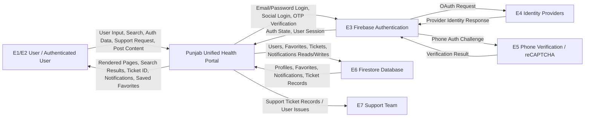
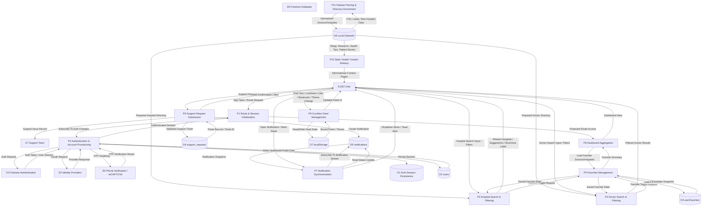

# Current Project Data Flow Diagram (DFD)

## Scope

This DFD is based on the active Vite/React application rooted in `src/`, with Firebase Authentication and Firestore as the primary backend services. The `unified-clone/` directory is a parallel Next.js variant that mirrors much of the same content and routes, but it is not the primary runtime entry point of the current project because the root app boots from `src/main.jsx`.

## Brief System Flow

The application is a Punjab healthcare portal that lets users browse hospitals, search doctors, read health content, sign up or log in with Firebase Authentication, save favorites, submit support requests, and view real-time notifications. Static healthcare datasets are prepared from CSV and JSON files inside the repository, then consumed directly by React pages. Authenticated features persist data in Firestore, while the CuraNex social feed is stored locally in the browser through `localStorage`.

## Main Modules

- `src/main.jsx`: bootstraps React, Router, `AuthProvider`, and `FavoritesProvider`
- `src/App.jsx`: defines main route map
- `src/context/AuthContext.jsx`: keeps auth state in app context
- `src/auth.js`: email, Google, provider, and phone OTP authentication flows
- `src/firebase.js`: Firebase app, auth, and Firestore initialization
- `src/context/FavoritesContext.jsx`: loads and updates user favorites
- `src/services/userFavorites.js`: Firestore favorites persistence
- `src/services/supportRequests.js`: Firestore support ticket and notification writes
- `src/hooks/useNotifications.js`: Firestore notification subscription and read updates
- `src/pages/FindHospitals.jsx`: hospital discovery and filtering flow
- `src/pages/FindDoctors.jsx`: doctor search and filtering flow
- `src/pages/Dashboard.jsx`: protected dashboard and saved favorites view
- `src/pages/Support.jsx`: support request form and ticket creation
- `src/pages/Login.jsx`, `src/pages/Signup.jsx`, `src/components/auth/PhoneAuthPanel.jsx`: authentication UI
- `src/pages/CuraNex.jsx`: local social feed, theme, and interaction state
- `src/data/*` and `src/utils/*`: dataset preparation and static content delivery

## External Entities

- `E1 User / Visitor`
- `E2 Authenticated User`
- `E3 Firebase Authentication`
- `E4 External Identity Providers (Google / GitHub / Facebook through Firebase)`
- `E5 Firebase Phone Verification / reCAPTCHA`
- `E6 Firestore Database`
- `E7 Support Team` (business recipient implied by support ticket storage and notification flow)

## Processes

- `P1 Route & Session Initialization`
- `P2 User Authentication and Account Provisioning`
- `P3 Hospital Search and Filtering`
- `P4 Doctor Search and Filtering`
- `P5 Favorites Management`
- `P6 Support Request Submission`
- `P7 Notification Synchronization`
- `P8 Dashboard Aggregation`
- `P9 CuraNex Community Feed Management`
- `P10 Static Health Content Delivery`
- `P11 Dataset Parsing and Directory Enrichment`

## Data Stores

- `D1 Firebase Auth Session Persistence`
- `D2 Firestore users collection`
- `D3 Firestore userFavorites collection`
- `D4 Firestore support_requests collection`
- `D5 Firestore notifications collection`
- `D6 Local healthcare datasets`
- `D7 Browser localStorage for CuraNex`

## Data Stores Detail

- `D1 Firebase Auth Session Persistence`
  - Browser persistence configured through IndexedDB, local persistence, and in-memory fallback
- `D2 Firestore users collection`
  - User profile data written after signup, social sign-in, or OTP verification
- `D3 Firestore userFavorites collection`
  - `likedDoctors`, `likedHospitals`, and `updatedAt`
- `D4 Firestore support_requests collection`
  - support ticket payloads with category, issue, priority, status, and timestamps
- `D5 Firestore notifications collection`
  - live notification records used by the navbar dropdown and toast
- `D6 Local healthcare datasets`
  - `punjab_doctors_list.csv`, `doctorContactLeads.js`, `hospitals.raw.json`, `blogs.js`, `research.js`, `patientStories.js`, and derived JS modules
- `D7 Browser localStorage for CuraNex`
  - `curanex-posts` and `curanex-theme`

## Key Data Flows

- `F1 User Input`: search text, filter choices, auth credentials, OTP, support form data, post content
- `F2 Session State`: auth listener output from Firebase to `AuthContext`
- `F3 User Profile Data`: signup/social/OTP profile data written to Firestore `users`
- `F4 Filtered Directory Results`: filtered doctor and hospital records rendered to UI
- `F5 Favorite Toggle Request`: doctor/hospital like actions sent to Firestore
- `F6 Favorite Snapshot`: saved favorites loaded into `FavoritesContext`
- `F7 Support Ticket Data`: validated support form persisted to Firestore `support_requests`
- `F8 Ticket Confirmation`: returned ticket ID and success message
- `F9 Notification Stream`: Firestore snapshot updates for navbar dropdown and toast
- `F10 Read Status Update`: notification read acknowledgement sent back to Firestore
- `F11 Social Feed Data`: local posts, comments, likes, bookmarks, and theme state saved to localStorage
- `F12 Prepared Dataset`: CSV/lead/raw hospital data transformed into app-ready doctor and hospital directories
- `F13 Informational Content`: blogs, research, health tips, and patient stories rendered from local modules

## Level 0 DFD (Context Diagram)

## Level 1 DFD (Detailed Diagram)

## Notes and Boundaries

- Hospital and doctor discovery are frontend-filtered against repository datasets, not fetched from a remote API.
- Favorites, support requests, notifications, and user profiles are the main persistent server-side flows and all point to Firestore.
- CuraNex is currently browser-local and does not sync with Firestore or any backend API.
- Notification creation currently occurs as a secondary write after support request creation.
- The support team does not have an implemented UI in this codebase; it is modeled as an external business entity because the stored tickets are meant for operational follow-up.
